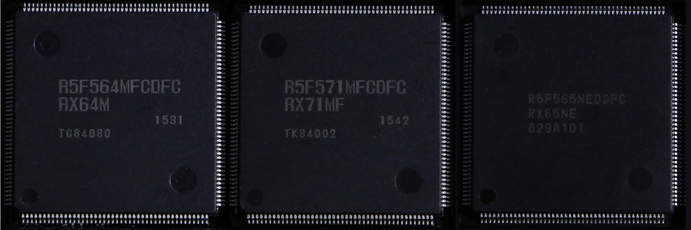
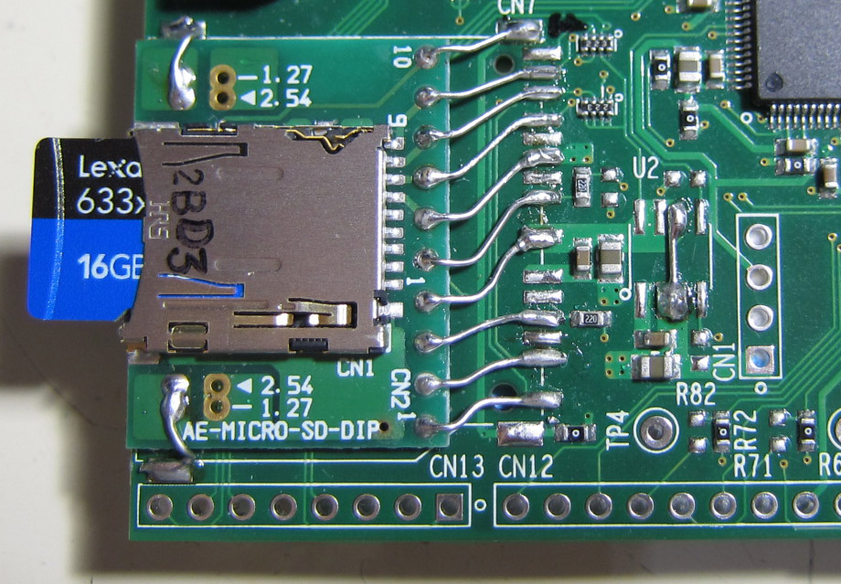

Renesas RX Microcontroller
=========

   
[Japanese](READMEj.md)
   
## Overview
   
This is a program by Renesas RX microcontroller and its compiler rx-elf-gcc, g ++.   
   
Currently, a dedicated writing program has been implemented that has been tested on Windows, OS-X, and Linux.   
Development is now possible in multiple environments.   
   
- Currently supported and tested devices are RX24T, RX64M, RX65N, RX71M.   
I extend the device class daily.   
- I update it daily including directory configuration.   
   
Project consists of Makefile, related header, source code, dedicated startup It consists of routines and linker scripts.   
   
    
Space Invaders Emulator, NES Emulator, for RX65N Envision kit   
    
WAV/MP3 Audio Player, File selector, for RX65N Envision kit   
   
<a href="http://www.youtube.com/watch?v=frRI-cbzGus" target="_blank"></a>   
YouTube: NES Emulator for RX65N Envision kit
   
Device control classes with template design patterns provide flexible and concise functionality.   
Due to its functionality, it does not require difficult or complicated settings or code generation by separate programs.   
   
```
// LED flashing program
#include "common/renesas.hpp"

namespace {
    typedef device::system_io<12000000> SYSTEM_IO;  // External connection crystal is 12MHz
    typedef device::PORT<device::PORT0, device::bitpos::B7> LED;  // LED connection port
}

int main(int argc, char** argv);

int main(int argc, char** argv)
{
    SYSTEM_IO::setup_system_clock();

    LED::OUTPUT();
    while(1) {
        utils::delay::milli_second(250);
        LED::P = 0;
        utils::delay::milli_second(250);
        LED::P = 1;
    }
}
```
   
In order to complete the process from dependency rule generation to compilation and linking, usually with a single "make" command,
 I do not need it.   
No need for a dedicated boot program or loader I can write and execute.
   
---
## Description
   
In device I / O operation, a dedicated header is prepared using template class library implemented in C ++, and utility and class library are also enhanced.   
- Some of them use a library made by Renesas.   
   
|Directory/file|Contents|
|-----------------------|----------------------------------------------|
|[/RX600](./RX600)      |RX microcontroller common device definition class|
|[/RX24T](./RX24T)      |Device definition class dedicated to RX24T, linker script icon common device definition class|
|[/RX64M](./RX64M)      |Device definition class dedicated to RX64M, linker script icon common device definition class|
|[/RX71M](./RX71M)      |Device definition class dedicated to RX71M, linker script icon common device definition class|
|[/RX65x](./RX65x)      |Device definition class dedicated to RX65(1N), linker script icon common device definition class|
|[/RX66T](./RX66T)      |Device definition class dedicated to RX66T, linker script icon common device definition class|
|[/ff12b](./ff12b)      |ChaN's fatfs source code and handler for RX microcontroller|
|[/common](./common)    |Shared classes, utilities, etc.|
|[/chip](./chip)        |Device-specific control driver library for I2C, SPI, etc.|
|[/graphics](./graphics)|Graphics drawing relation class|
|[/sound](./sound)      |Sound, audio relationship class|
|/r_net                 |Renesas T4 (TCP / UDP) library, C ++ handler, wrapper|
|/libmad                |MP3 decoding, mad library|
|[rxprog](./rxprog)     |Program writing tool to RX microcontroller flash (Windows, OS-X, Linux compatible)|
|[FIRST_sample](./FIRST_sample)|LED flashing program for each platform|
|[SCI_sample](./SCI_sample)|Each platform, corresponding SCI sample program|
|[RAYTRACER_sample](./RAYTRACER_sample)|For each platform, Ray tracing benchmark|
|/rx24t_SDC_sample      |SD card operation sample using RX24T|
|/rx24t_GPS_sample      |GPS operation sample using RX24T|
|/rx24t_DATA_FLASH_sample|Internal data flash operation sample using RX24T|
|/rx64m_SDRAM_sample    |Control sample of SDRAM using RX64M (128 Mbit × 2, 32-bit bus)|
|/rx64m_RTC_sample      |Operation sample of built-in RTC using RX64M|
|/rx64m_TPU_sample      |Control sample of TPU using RX64M (timer interrupt)|
|/rx64m_DMAC_sample     |DMAC control sample using RX64M (memory operation)|
|/rx64m_DA_sample       |Built-in D / A conversion using RX64M, sample of TPU, DMAC|
|/rx64m_AUDIO_sample    |Sample for Renesas RX64M microcontroller board (audio player)|
|/GR-KAEDE_ftps         |Sample for Renesas RX64M microcontroller board (FTP server)|
|/GR-KAEDE_http         |Sample for Renesas RX64M microcontroller board (http server)|
|/RTK5_AUDIO_sample     |Renesas RTK5RX65N microcontroller board audio player|
|/RTK5_SIDE             |Renesas RTK5RX65N microcontroller board Space Invaders emulator|
|/RTK5_NESEMU           |Renesas RTK5RX65N microcontroller board NES emulator|
|[/LICENSE](./LICENSE)  |License notation file|
   
- Although not in the above list, please think that directories and files that exist when you check out are working.   
   
---
## RX Development environment preparation (Windows、MSYS2)
   
 - On Windows, install the MSYS2 environment in advance.   
 - MSYS2 has msys2, mingw32, mingw64 and 3 different environments, but gcc for RX microcontroller
   Because it is necessary to build of, do with msys2.   
1. MSYS2 is a UNIX-based application development environment.
2. MINGW32 is an environment for i686 that the exception model of gcc is not war related to SEH because of Borland patent.
3. MINGW64 is an environment for developing Windows-based applications.   
   
 - MSYS2 upgrade
```
   pacman -Sy pacman
   pacman -Syu
```
   
- Open the console again. (You should see a message as you reopen the console)   
   
```
   pacman -Su
```
- The update is done multiple times, then follow the instructions on the console.
- You need to reopen the console several times.

- Install gcc, texinfo, gmp, mpfr, mpc, diffutils, automake, zlib, tar, make, unzip, git commands etc
```
   pacman -S gcc
   pacman -S texinfo
   pacman -S mpc-devel
   pacman -S diffutils
   pacman -S automake
   pacman -S zlib
   pacman -S tar
   pacman -S make
   pacman -S unzip
   pacman -S zlib-devel
   pacman -S git
```
   
---
## RX Development environment preparation (OS-X)
   
- In OS-X, install macports in advance.   
  brew is not recommended because it has less flexibility   
- Depending on the version of OS-X, you may need to install X-Code, Command Line Tools, etc. in advance   
 - macports upgrade   
```
   sudo port -d self update
```
- As you probably know, in the early stage of OS-X, llvm starts by calling gcc.
- However, llvm can not currently build gcc cross compilers.
- So, I will install gcc on macports, I will use the 5 series version.
```
   sudo port install gcc5
   sudo ln -sf /opt/local/bin/gcc-mp-5  /usr/local/bin/gcc
   sudo ln -sf /opt/local/bin/g++-mp-5  /usr/local/bin/g++
   sudo ln -sf /opt/local/bin/g++-mp-5  /usr/local/bin/c++
```
- You may need to reboot.
- For now, please check.
```
   gcc --version
```
   
```
   gcc (MacPorts gcc5 5.4.0_0) 5.4.0
   Copyright (C) 2015 Free Software Foundation, Inc.
   This is free software; see the source for copying conditions.  There is NO
   warranty; not even for MERCHANTABILITY or FITNESS FOR A PARTICULAR PURPOSE.
```
   
 - Install texinfo, gmp, mpfr, mpc, diffutils, automake command etc
```
   sudo port install texinfo
   sudo port install gmp
   sudo port install mpfr
   sudo port install libmpc
   sudo port install diffutils
   sudo port install automake
```
   
---
## RX Development environment preparation (Ubuntu)

- There are multiple Linux environments, so here we will write the case for the "Ubuntu 16.04 LTS" environment.
   
- Install texinfo, gmp, mpfr, mpc, diffutils, automake command etc
```
   sudo apt-get install texinfo
   sudo apt-get install libgmp-dev
   sudo apt-get install libmpfr-dev
   sudo apt-get install libmpc-dev
   sudo apt-get install diffutils
   sudo apt-get install automake
   sudo apt-get install zlib1g-dev
```
   
---
## RX Development environment construction
   
- The RX compiler (rx-elf-gcc, g ++) uses "gcc-6.4.0".   
- Download "binutils-2.30.tar.gz".   
- Download "gcc-6.4.0.tar.gz".   
- Download "newlib-2.4.0.tar.gz".   
- There are multiple versions of binutils, gcc and newlib, but some combinations   
  It has been found that ineligible binaries (which have subtle problems with operation) will be built.
- This bug occurs when using Renesas network stack (net_T4).
- It is not possible to identify the cause why such malfunction occurs.
- Here is a list of combinations that we have investigated.
```
   binutils-2.27, gcc-4.9.4, newlib-2.2.0 ---> OK
   binutils-2.27, gcc-5.5.0, newlib-2.2.0 ---> OK
   binutils-2.27, gcc-5.5.0, newlib-2.4.0 ---> OK
   binutils-2.27, gcc-6.4.0, newlib-2.4.0 ---> OK
   binutils-2.28, gcc-6.4.0, newlib-2.4.0 ---> OK
   binutils-2.30, gcc-6.4.0, newlib-2.4.0 ---> OK (current)
   binutils-2.30, gcc-6.4.0, newlib-3.0.0 ---> NG 
```
- Using the latest gcc seems to be faster code, especially for C++.
   
---
#### build binutils-2.30
```
   cd
   tar xfvz binutils-2.30.tar.gz
   cd binutils-2.30
   mkdir rx_build
   cd rx_build
   ../configure --target=rx-elf --prefix=/usr/local/rx-elf --disable-nls
   make
   make install     OS-X,Linux: (sudo make install)
```

-  Pass PATH to /usr/local/rx-elf/bin (edit .bash_profile and add path)

```
   PATH=$PATH:/usr/local/rx-elf/bin
```

- Open the console again.

```
   rx-elf-as --version
```

- Execute the assembler command and check if the path is valid.
  
#### Build C compiler
```
    cd
    tar xfvz gcc-6.4.0.tar.gz
    cd gcc-6.4.0
    mkdir rx_build
	cd rx_build
    ../configure --prefix=/usr/local/rx-elf --target=rx-elf --enable-languages=c --disable-libssp --with-newlib --disable-nls --disable-threads --disable-libgomp --disable-libmudflap --disable-libstdcxx-pch --disable-multilib --enable-lto
    make
    make install     OS-X,Linux: (sudo make install)
```
  
#### Build newlib
```
    cd
    tar xfvz newlib-2.4.0.tar.gz
	cd newlib-2.4.0
    mkdir rx_build
    cd rx_build
    ../configure --target=rx-elf --prefix=/usr/local/rx-elf
	make
    make install     OS-X: (sudo make install)
```
- In Linux environment, sudo command does not recognize the path of binutils set up locally.
"Make install" will fail, so write the following script and execute it.
```
#!/bin/sh
# file: rx_install.sh

PATH=${PATH}:/usr/local/rx-elf/bin
make install
```
   
```
    sudo rx_install.sh
```
   
#### Build C++ compiler
```
    cd
    cd gcc-6.4.0
    cd rx_build
    ../configure --prefix=/usr/local/rx-elf --target=rx-elf --enable-languages=c,c++ --disable-libssp --with-newlib --disable-nls --disable-threads --disable-libgomp --disable-libmudflap --disable-libstdcxx-pch --disable-multilib --enable-lto --with-system-zlib
    make
    make install     OS-X,Linux: (sudo make install)
```
---
   
 - The built compiler collection is listed in the link below. (MSYS2 only)   
http://www.rvf-rc45.net/Renesas_GNU_Tools/ 

---
## Get RX Framework Source Code
```
    git clone git://github.com/hirakuni45/RX.git
```
   
---
### Boost installation used by RX framework
```
    pacman -S mingw-w64-x86_64-boost   (for MSYS2)
    sudo port install boost   (for OS-X)
    sudo apt-get install boost    (for Linux)
```
   
---
## RX Build all projects
```
    sh all_project_build.sh [clean]
```
--- 
## RX デバイスへのプログラム書き込み方法

幾つかの方法がありますが、最も簡単で、コストがかからない方法は、シリアルインターフェースを使って   
書き込む方法です。   
※但し、書き込み速度は、あまり上がりません。   
USB インターフェース内臓の RX マイコンの場合は、USB でブートして接続する事もできますが、ドライバー   
は、Windows 版しか対応しないようです。（この辺りの事情は詳しく調査していない為間違っているかもしれません）   
   
また、全ての RX マイコンが USB インターフェースを内臓しているわけでは無い為、もっとも一般的な、   
シリアルインターフェースを使って書き込む方法を紹介します。   
シリアルインターフェースでの書き込みは、速度はそれなりですが、簡単確実で、接続も簡単。   
   
※シリアルポートとの接続、ブートモードへの切り替えについては、ハードウェアマニュアルに書かれていま   
すので参考にして下さい。   
通常、ＭＤ端子を、Ｌ又はＨにする事で、プログラムと内臓ＲＯＭの実行を切り替えできます。   
   
※USB シリアル変換モジュールなどを使うと、電源も取れて簡単です。   
※（秋月電子、シリアル変換モジュール）http://akizukidenshi.com/catalog/g/gK-06894/   
※（CP2102 シリアル変換モジュール）https://www.amazon.co.jp/%E3%80%90%E3%83%8E%E3%83%BC%E3%83%96%E3%83%A9%E3%83%B3%E3%83%89%E5%93%81%E3%80%91USB%E2%86%92TTL-%E3%82%B3%E3%83%B3%E3%83%90%E3%83%BC%E3%82%BF%E3%83%BC%E3%83%A2%E3%82%B8%E3%83%A5%E3%83%BC%E3%83%AB-%E3%82%A2%E3%83%80%E3%83%97%E3%82%BF%E3%83%BC-CP2102-%E3%82%B7%E3%83%AA%E3%82%A2%E3%83%AB%E5%A4%89%E6%8F%9B/dp/B008RF73CS/ref=sr_1_1?ie=UTF8&qid=1477589109&sr=8-1&keywords=%EF%BD%83%EF%BD%90%EF%BC%92%EF%BC%91%EF%BC%90%EF%BC%92
(1) RXD シリアル受信   
(2) TXD シリアル送信   
(3) VCC 電源（５Ｖ又は３．３Ｖ）   
(4) GND 電源 ０Ｖ   
※３．３Ｖは限られた電流しか取り出せない為、必ずレギュレーターが必要です。   
※中国製の格安なモジュールは、品質が安定していない為、お勧めしません、それらの事   
項を理解していて対処出来る人だけ利用すると良いと思います。   
   
 - 接続方法、ブートモードの設定などは、各デバイスのハードウェアー・マニュアルに詳細があります。   
   
## RX フラッシュプログラマーの構築

 - 現在、RX63T、RX24T、RX64M、RX71M へのフラッシュ書き込みを確認しています。
 - リセットは、制御していないので、書き込み時にリセット信号をアサートする必要があります。
 - 現在のバージョンでは、消去、書き込み、比較 の動作のみ実装されています。
 - コードプロテクトの ID 設定や比較などは未実装です。
 - RX24T、RX63T では、接続が確立した時に、消去が自動で行われる為、消去動作は無視されます。
 - rx_prog のビルドには「boost」が必要です。（通常最新バージョンを使う）
 - boost はヘッダーのみ利用なので、ビルドの必要はありません。
 - mingw64 環境などに pacman を使い boost をインストールして使っています。

``` 
    pacman -S mingw-w64-x86_64-boost   
```

 - rxprog のビルド（MSYS2）
 - ビルドした実行ファイルは、/usr/local/bin に配置します。

```
    cd rxprog
    make
    make install
　　※/usr/local/bin にパスを通しておく。
```
 - rx_prog.conf を編集して、接続する COM ポート、ボーレートの設定をする。
 - /dev/ttyS10 -> COM11 に相当します。（数字に＋１する）
 - 「rx_prog.conf」には、標準のシリアルポートを記述できます、自分の環境に合わせて設定しておくと良いでしょう。
 - ポートの設定は、開発環境の違いに対応できるように、Windows、OS-X、Linux と環境別のポートを設定できます。
 - 各プロジェクトの「Makefile」には、「make run」で書き込めるスクリプトが設定されています。
   
---
## Renesus ENVISION KIT-RX65N を使った開発


 - ルネサスが販売する「RTK5RX65N」は、LCD 付きでありながら低価格で高機能なボードです。   
 - もちろんラズベリーPiなどとは比較はできませんが、スタンドアロンで動かす事の出来る手頃なマイコンボードだと思えます。
 - また、このボードには、「E1 Lite エミュレーター」が内臓されており、USB 接続で、簡単にプログラムを書き込む事が出来ます。（Windows 環境で、Renesus Flash Programmer を使って書き込める）
 - DIP SW 1, 1 を「ON」にする事で、内臓エミュレーターが有効になり、「Renesas Flash Programmer」
   実行バイナリーを書き込めます。
 - DIP SW 1, 1 を「OFF」にする事で、書き込んだプログラムが単独で実行します。
 - 初期状態では、SD カード、イーサーネット関係の部品などが抜けていますが、後から自分で取り付ける事が出来ると思います。
 - このボード標準の SD カードソケットは、製造が終了しており、日本では入手性が悪く、価格も高い為、別の方法を推奨します。
 - 秋月電子製のマイクロ SD ソケットアダプタを介して接続するのが簡単です。   



---
## 何故、独自の開発環境（フレームワーク）を使うのか？

現在、ルネサス社が提供する gcc ベースの IDE 環境を使う事が出来ますが、私は、IDE が嫌いです。   
マウスでメニューを操作する必要があり、操作の方法を新たに覚える必要があるのには、抵抗があり   
ます。   
それと、gcc と言っても、独自の改造がしてあり、完全に「素」の gcc とは言えないのが問題と   
思います。   
※ルネサス社には独自の「開発環境」に対する考え方がありますが、必ずしも、それが、自分のス   
タイルに合うとは限りません。   
   
自分は、昔ながらの CUI 環境の方が手っ取り早く、操作性や見通しが良く扱いやすいです。   
emacs、gcc、make、があれば十分なのです。   
また、歴史的に、開発ツールは「有償であるべきである」との考えがあります。（サポートも含む）   
しかしながら、現代においては、数十万円のコンパイラに投資して製品を開発する事が出来るのは   
大量生産が可能な機器に絞られると思います、それゆえ、gcc で開発をするのは、当然の結果と言   
えるのだと思えます。   
※公開してある「Makefile」には独自の工夫がしてあり、最小限の編集で、プロジェクトをビルド   
出来るように自動化の為のスクリプトが入れてあります。   
※通常の「Makefile」は、従属規則を書くのは「自動」ではありません、新規にファイルを追加し   
たら、それに伴って、従属規則を更新しなければなりません。   
また、ソースファイルにインクルードしているローカルなファイルを変更した場合にもこれを怠る   
と、関係するソースファイルが適切にコンパイルされず、古いオブジェクトをリンクしてしまう事   
があります。   
この「Makefile」では、「従属規則」の生成は、ほぼ自動化してあり、そのようなトラブルが起こ   
る事を最小限にする事が出来ます。   
※事前に、何かファイルを生成したりする必要が全く無いように工夫してあります。   
ユーザーは、ターゲット名、リンクするソースを適宜編集するだけです。   
後は「make」と打てば、従属規則（どのソースがどのヘッダーをインクルードしているか？）は自動   
で生成します。   
また C++ では、ヘッダーと実装を分ける必要がほぼ無くなる為、Makefile を編集してソースを追加
する事がほぼ無くなります。   
   
---
   
次の問題は、ルネサス社が提供する、ハードウェアー定義、デバイスドライバーです。   
これらは、多くの場合、ルネサス社の標準コンパイラ向けのコードで、gcc ではコンパイルできな   
い場合があり、また、Ｃ言語をベースにした物であり、不満があります。   
また、公開されているデバイスドライバーも、ファイル名、構成、見通し、など、かなり不満があ   
ります。   
※C++ から、C 言語の関数を呼ぶ事は可能なのだから、自分でわざわざデバイスドライバーを作る   
のは、無意味だと言った人もいますが、その人の考え方と、私は根本的に異なります。   
「より良い」と思う物を作りたいだけです。   
Arduino は C++ がベースとは言え、C++ の優れた機能をあまり活用していません C++ を前面にし   
た、新しい試みを開拓したいと思っていました。   
   
最初にルネサス社のマイコンを始めた段階で、まず gcc の構築から初めて、十分実用になる事を確   
認しました。   
次に、C++ の理解を深める学習の一環で、デバイス定義をクラス化して、C++ ぽく、デバイスにアク   
セスするクラスを実装しました。   
デバイスドライバも、より簡単に、少ない手順で、使いたいので、多くを独自に実装しています。   
※ルネサス社が提供する、ハードウェアー定義の「iodefine.h」は、独自の環境でしかコンパイルす   
る事ができず、また、可読性が非常に悪いです、本来モジュール定義コードに詳細なハードウェアー   
マニュアルを添付すべきと思っているくらいです。   
※ビットフィールドを定義する方法は、標準化委員会では、「バイト」単位では認めていても、それ   
以外は規約違反（バイトオーダーで表現が異なる為）です。   
私が提供する C++ ベースのデバイス定義クラスは、C++14以降なら、どの環境でも、特殊な定義無し   
で完全にコンパイルする事が可能です。   
※現在、最適化無しでコンパイルした場合、リンクに失敗します、修正中です。   
   
※ルネサス社純正コンパイラは、独自の拡張がされており、それらは標準化委員会が定めた規約から   
逸脱する場合もあるように思います、そのような独自拡張されたコンパイラ向けに書かれたソースは   
他のコンパイラではそのままコンパイル出来ない場合もあり、あまりメリットを感じません。   
   
「gcc 環境ではまともなデバッグが出来ない」
と言う人がいますが、本当にそうでしょうか？   
確かに IDE には、見た目と操作性が良い GUI があり、そのような場合は時間の短縮になる場合もあ   
りますが、自分の経験では、そのような環境がどうしても必要と感じた事はほぼ無く、シュミレータ   
ーを使ったり、PC 上でエミュレーションするなど、工夫次第でどうにでもなります。   
   
---
## 何故、C++ なのか？
   
コンピューター言語は、マシンの為にあるのでは無く、人間の可読性の為に存在すると思っています。   
それなら、マシンに媚びた構成では無く、より人間が理解しやすく間違いが少ない方が良いと思いま   
す。   
C++ は、C 言語に文法が似ていますが全く異なったコンピュータ言語です。   
※多くの C 言語プログラマーがこの事実を受け入れないでいます、C++ を習得するには、全く新しい   
言語を習得する覚悟と時間（コスト）が必要だと思います。（それに見合う価値があると思います）   
   
RX71M は 240MHz で動作し、512KB のメモリを内蔵しています、この「進化」はこれからも加速して   
いく事と思います、そんな状況なのに、何故、開発者がマシンに寄った環境に甘んじて開発を行わな   
ければいけないのでしょうか？   
C++ での実装は、それら対する一つの回答です、また、コンパイラの進化により、ますます最適化が   
加速する事と思います。   
   
---
   
☆以下は C++ 的 LED を点滅するプログラム例です。   
(1) マイコン接続のクリスタルは 12MHz   
(2) LED の接続ポートは、PORT0、B7   
(3) 点滅間隔は 0.25 秒   
※マイコンの動作速度は、Makefile で設定   
※他、シリアル通信、ＳＤカードアクセスなど豊富なサンプルがあります。   
```
#include "common/renesas.hpp"

namespace {
    typedef device::system_io<12000000> SYSTEM_IO;
    typedef device::PORT<device::PORT0, device::bitpos::B7> LED;
}

int main(int argc, char** argv);

int main(int argc, char** argv)
{
    SYSTEM_IO::setup_system_clock();

    LED::DIR = 1;
    while(1) {
        utils::delay::milli_second(250);
        LED::P = 0;
        utils::delay::milli_second(250);
        LED::P = 1;
    }
}
```
   
---
   
☆以下は C++ 的 SCI で通信するプログラム例です。   
(1) SCI の設定に関する部分のみで、他は LED 点滅プログラムと共通です。   
(2) SCI の標準ポートは、port_map.hpp により定義されており、選択するポートが複数ある場合   
「第二候補」や「第三候補」を設定すればよく、面倒な設定を行う必要はありません。   
(3) ボーレートは整数で設定すれば良く、内部で、設定周波数から自動的に計算されます。   
(4) 割り込みを使う場合でも、使わない場合（ポーリング）でも使う事が出来ます。   
(5) 送信、受信は、固定長 FIFO クラスを通して行われ、サイズは、自由に定義する事が出来ます。   
(6) sci_putch、sci_getch 関数は、POSIX のファイル関数から呼ばれるので、外部からリンクできるようにしておきます。   
(7) 上記関数は、stdout、stdin、stderr ディスクリプタからアクセスされます、従って、printf 関数も使う事が出来ますが、色々な理由で推奨しません「utils::format」を使って下さい、その方がサイズが小さくなり、自由度が大きく便利で安全です。   
```
#include "common/fixed_fifo.hpp"
#include "common/sci_io.hpp"
#include "common/format.hpp"

namespace {

//  SCI9 を使用
    typedef device::SCI9 SCI_CH;

    typedef utils::fixed_fifo<char, 512> RXB;  // RX (RECV) バッファの定義
    typedef utils::fixed_fifo<char, 256> TXB;  // TX (SEND) バッファの定義

    typedef device::sci_io<SCI_CH, RXB, TXB> SCI;
// SCI ポートの第二候補を選択する場合
//	typedef device::sci_io<SCI_CH, RXB, TXB, device::port_map::option::SECOND> SCI;
    SCI     sci_;
}

extern "C" {

    // syscalls.c から呼ばれる、標準出力（stdout, stderr）
    void sci_putch(char ch) { sci_.putch(ch); }

    void sci_puts(const char* str) { sci_.puts(str); }

    // syscalls.c から呼ばれる、標準入力（stdin）
    char sci_getch(void) { return sci_.getch(); }

    uint16_t sci_length() { return sci_.recv_length(); }
}

int main(int argc, char** argv);

int main(int argc, char** argv)
{
    SYSTEM_IO::setup_system_clock();

	{  // メイン、SCI 開始
       uint8_t intr = 2;        // 割り込みレベル
       uint32_t baud = 115200;  // ボーレート
       sci_.start(baud, intr);
	}

	//-----
	{  // メイン、SCI 出力
       utils::format("Start SCI\n");
	}

	// 永久ループ
	while(1) ;
}
```
   
-----
   
License
----

MIT
